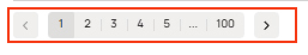

# **Список найденных ошибок**

| #  | Название бага                                                              | Скриншот | Приоритет | Описание                                       |
|----|----------------------------------------------------------------------------|----------|-----------|---------------------------------------------------------------|
| 1  | Не отображается главная навигационная панель сайта                          |  | High      | Отсутствие этой панели критически влияет на работу сайта, так как пользователи не могут зарегистрироваться, авторизоваться, управлять своими объявлениями или создать новое. Необходимо как можно скорее устранить проблему, чтобы восстановить полноценную работу платформы.     |
| 2  | Некорректное отображение кнопки "Все категории" (не видно буквы "И")       |  | Medium    | Визуальная ошибка в главном меню нарушает восприятие интерфейса. |
| 3  | Ошибка без описания на странице с результатами поиска                       |  | High      | Непонятная ошибка мешает пользователю понять суть проблемы.   |
| 4  | Некорректная работа фильтра "Сначала из Москвы"                             |  | High      | В выдаче отображаются товары из других городов(Липецк, Санкт-Петербург), что сбивает с толку. |
| 5  | Некорректная работа фильтра по бренду                                       |  | High      | При фильтре по бренду "Author" в результате поиска выводятся товары других брендов.          |
| 6  | Ошибка загрузки блока с дополнительными фильтрами                           | | High      | Фильтры отображаются некорректно. Отсутствуют блоки фильтров "Акции" и "Тип рамы", а в блоке "Пол" отсутствует пункт "Для всех"             |
| 7  | Неверная пагинация      |  | High      | Если найдено 61 объявление, то должно отображаться 3 страницы пагинации вместо 99   |
| 8  | Заголовок с результатами поиска не соответствует количеству найденных и выведенных объявлений |  | High      | Заголовок с результатами поиска не соответствует количеству найденных и выведенных объявлений, т.к тогда на первой страницы выдачи должно было выводиться максимальное кол-во товаров -  30. Если найдено 61 объявление, то на 1ой страницы выдачи  должно быть выведено 30 объявлений, а не только 12. |
| 9  | Кнопка "Показать 9 объявлений" не соответствует количеству найденных и выведенных объявлений, которое равно 12        |  | Medium    | Логика подгрузки объявлений не соответствует ожиданиям.       |
| 11 | Некорректная работа фильтра сортировки по цене "Дороже"                                    |  | Medium    | При выборе фильтра "Дороже" объявления должны отсортированы  по убыванию цены, но фактически встречаются товары с более низкой ценой выше, чем более дорогие.                 |
| 12 | Неверное указание времени пешей доступности до метро (11-15 часов)          |  | Medium    | Физически невозможно, вызывает недоверие к информации.        |
| 13 | Несоответствие города и метро в карточках              |  | Medium    | Пользователь получает некорректные данные о местоположении.   |
| 14 | Некорректное отображение товаров при выборе режима отображения "Карта"                  |  | Medium    | При выборе режима **"Карта"** объявления отображаются сеткой. |
| 15 | Ошибка в названии станции метро ("Ховин" вместо "Ховрино")                  |  | Low       | Небольшая ошибка в тексте, портит точность информации.        |
| 16 | Некорректное отображение иконки выбора региона                  |  | Low       | Используется иконка маркера навигации, вместо иконки геометки. Это может ввести пользователя в заблуждение, так как обычно используется для указания текущего местоположения, а не для выбора региона вручную.        |
| 17 | Некорректное отображение выбора региона                 |  | Low       | В интерфейсе должно быть "Москва, район, метро, радиус", но "радиус" отсутствует.        |
| 18 | Несоответствие цветового оформления и визуальной целостности поисковой панели                |  | Low       |  Кнопки на основной поисковой панели должны быть голубого цвета, соответствующего ключевым элементам управления сайта, а иконки и текст на них — белого цвета. Поле поиска должно быть обведено голубым цветом и визуально сливаться с кнопкой "Найти", образуя единый элемент без разрывов в восприятии.        |
| 19 | Отсутствует цена у велосипеда Atom                |  | Medium       |  Пользователь не видит цену товара, что делает объявление бесполезным.        |
